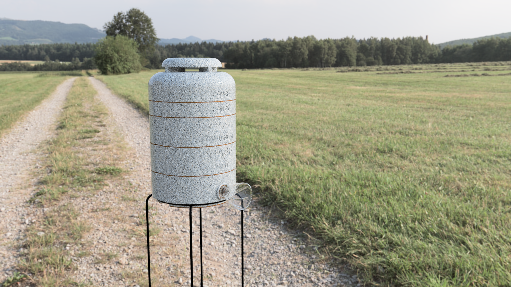
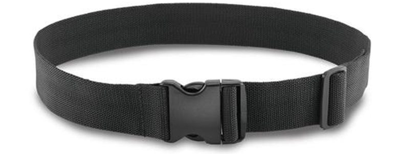
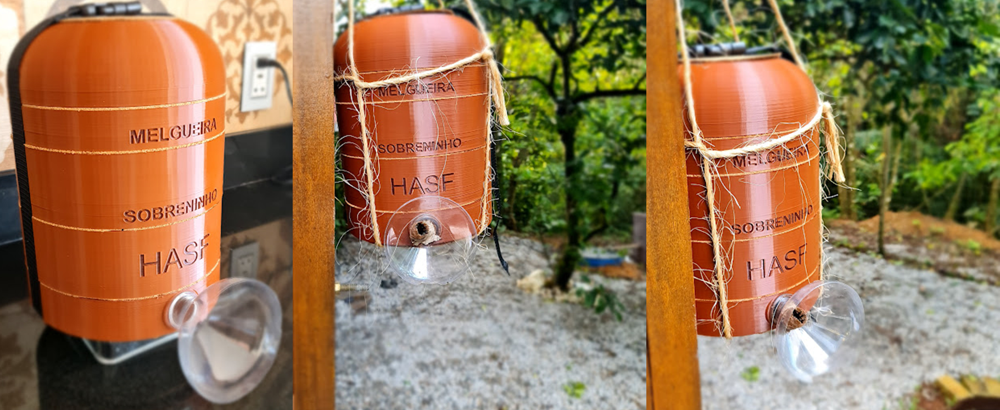
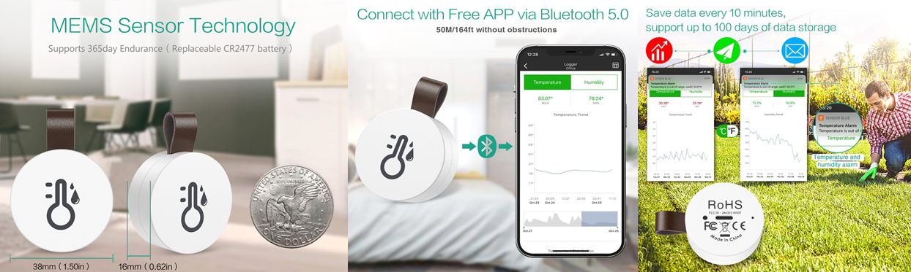
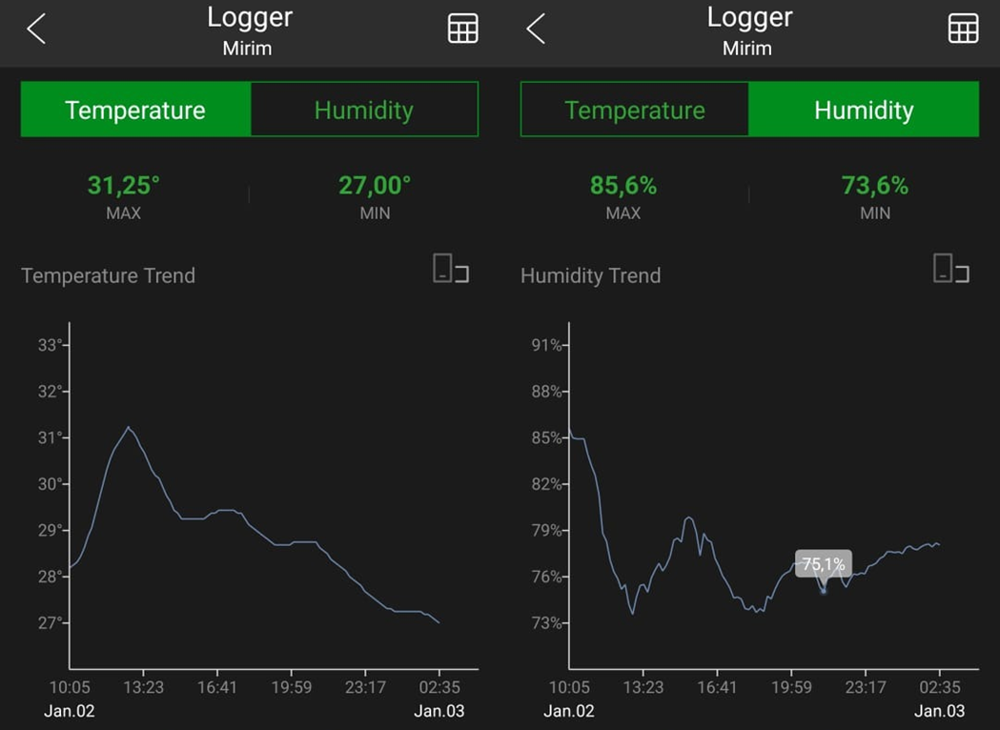

# HASF v2
HASF Stingless Bee Hive (Halla Abelha Sem Ferrão)

*Read this in other languages: [English](README.md), [Portuguese Brazil](README.pt-br.md)

It is the prototype of a stingless bee box that uses the concept of INPA boxes, thus facilitating handling. The objectives of this model are:
* facilitate management through 5 blocks: base, nest, over-nest, super (honey chamber) and cover
* low cost and durable
* be scalable
* reduce human contact during the honey extraction process
* test the use of prefabricated honey pots
* be portable
* be light
* withstand extreme cold and heat

## Table of Contents
  - [HASF v2](#HASF-v2)
    - [Motivation](#Motivation)
    - [Modular Design](#Modular-Design)
    - [Heat and Cold resistant](#Heat-and-Cold-resistant)
    - [Durable Materials](#Durable-Materials)
    - [Portable](#Portable)
    - [Easy to Operate](#Easy-to-Operate)
    - [Low Cost](#Low-Cost)
  - [Design Explanation](#Design-Explanation)
    - [Concept](#Concept)
    - [Base](#Base)
    - [Nest](#Nest)
    - [Over-Nest](#Over-Nest)
    - [Super (Honey Chamber)](#Honey-Chamber)
    - [Cover](#Cover)
    - [Roof](#Roof)
    - [Cork](#Cork)
    - [Acetate](#Acetate)
    - [Side Release Buckle Belt](#Side-Release-Buckle-Belt)
    - [In Use](#In-Use)
  - [Eletronics](#Eletronics)
  - [Next Steps](#Next-Steps)
  - [Version Changes](#Version-Changes)
  - [More Information](#More-Information)

## Motivation
In February 2015, [Flow Hive](https://www.honeyflow.com/) launched their Indiegogo campaign and surpassed their $70,000 goal 8 minutes later. They went on to raise $2.18 million in the first day. This shows how much people are interested in the topic and are willing to invest in beekeeping.
I found the idea brilliant and innovative, but when researching how I could create European or Africanized bees here in Brazil I came across a series of problems. Although it looks easy, it is not that simple and requires a license for creation. Many of the species available here are quite aggressive and even with this easy device it would require a handling course and protective equipment.
After research I discovered the stingless bees that in general are much less aggressive, their colonies are smaller and produce excellent quality honey, being very easy to breed. Embrapa Brazil, together with the Brazilian Association of Bee Studies, offers a free Meliponiculture course at https://www.youtube.com/watch?v=Mv78ZATrcTQ
During my research I noticed that the most used hive model in Brazil and even in other countries like Astralia is the INPA that were conceived by the researcher Fernando Oliveira when he worked at the National Institute for Research in the Amazon (INPA). The box model was baptized with its own name, Fernando Oliveira, however it became popular with the name of the institute.
The model was developed with the aim of facilitating the work of honey farmers. Thus optimizing the division of swarms and facilitating the collection of honey.
INPA boxes are made up of three basic modules: Nest, Over-Nest and Honey Chamber. So the size of the modules and the amount of honey pots will depend on each species of stingless bees that will be created in these INPA boxes.

## Modular Design
The proposed design has 5 blocks:
* Base: used for the entry of bees. In version 2, a labyrinth was introduced to help contain pests
* Nest: Place where the bees will place the nest. In version 2, the inlet has been moved from the center to the side of the box so that the air stream does not fall directly on the nest.
* Over-nest: place where the bees will place the brood combs used for the division of the hive
* Super (Honey Chamber): places where bees deposited honey
* Cover: beehive cover
* Cover with Roof: beehive roof for covers with ventilation

### Section View

## Heat and Cold resistant
Bees are very sensitive to changes in temperature, so essential to a stable environment. In nature, they use tree hollows that have excellent thermal resistance. To guarantee this thermal comfort, the final product will be produced from a concrete composed of cement, glue, vermiculite and styrofoam.
Why am I not using wood like many others? Simple, the wood of a living tree has different properties than the wood we use, it is a material that has worse thermal properties than the above materials and the use of wood may not be sustainable. Remember that we are here looking for alternatives that provide better welfare to bees. The table below presents the coefficient of thermal conductivity of some materials for comparison:

Material | Weight kgf/m3 | Thermal Conductivity W/m.C |
-------- | ------------- | -------------------------- |
Concrete | 2300 | 1.4 |
Cellular Concrete | 300 - 600 | 0.057 - 0.14 |
Polyurethane foam | 30 - 40 | 0.023 |
Wood (Pine) | 550 | 0.16 - 0.35 |
Vermiculite | 70 | 0.76 |

Many beekeepers are making bee boxes (isothermal box) using styrofoam concrete or cellular concrete with excellent results. (https://www.youtube.com/watch?v=zlzW1eoSt5g)
The idea is to improve this concept by adding vermiculite, which offers good thermal properties, in addition to the water absorption property that can also help control internal humidity.

The concrete will be composed of 1 part concrete, 2 parts vermiculite and 7 parts styrofoam. At this point I'm assuming that the thermal conductivity with these 3 components would be around 0.05 W/m.C. Applying the calculations of thermal conduction of a cylinder, assuming the internal radius of 113mm and the temperature of the colony is 32C, we obtain the following wall thickness for each of the external temperatures:

A 30mm wall could withstand up to an outside temperature of 0ºC

## Durable Materials
For testing purposes, 3D models are being printed with PLA. The future goal is for people to be able to make 3D printed boxes or buy recyclable plastic or concrete boxes.

### PLA used for prototyping
PLA filament is a material used for 3D printing, famous for having its degradation process biologically activated.
PLA is a thermoplastic polymer made with lactic acid from raw materials that have renewable sources.
Its preparation can be made from vegetables such as corn, manioc, beets or sugar cane.
Because it comes from organic matter, PLA is biodegradable and, therefore, compostable and recyclable.

### Recycled Polypropylene
This material is being considered more as an alternative to PVC and PET because of its clarity and its ease of converting. Much of the polypropylene is being used for closures on bottles, but at PolyPrime we have found this material to be a versatile material. Polypropylene has all the characteristics of HDPE with the added benefit of being produced in clears and tints. Even though polypropylene is not recyclable in a substantial number of municipalities, it is considered a sustainable material because it can be designed to reduce packaging and creates new packaging alternatives by using one substrate (i.e. paperboard box with a clear vinyl window).

### Light Concrete
Light concrete is a type of concrete with lower density that has numerous advantages of use and can be applied mainly in the construction of slabs and paving. Elements such as tiles, pillars, benches and counters can also present this material, with varying densities, adapted to the purpose of each element. The main advantages are:
- Thermal and acoustic insulation
- High resistance to impact and moisture
- Easier handling and applications
- Lightness and reduced transport costs
- Decreased fire risk
- Higher productivity in assembly and installation
- Flexibility, with different densities and patterns
- 100% recyclable material
- Compliance with technical standards
Light Concrete can be made of foam or expanded vermiculite in a 10:1 ratio.

## Portable
The hive needs to be portable, allowing easy handling and transportation when necessary.

## Easy to Operate
Because it is modular and plugable, you can mix modules, increase the number of honey chamber, etc. Another positive point is the ease of collecting honey due to the fact that the jars have a pattern
Based on some studies found on the Internet and used in Malaysia, Australia and Brazil, I developed a honeycomb that has a hexagonal structure with a diameter of 1.6 cm and height of 1.6 cm to standardize the construction of honey pots thus facilitating the its extraction. This structure can be created in plastic or using beeswax with silicone mold.
The idea is to test with Jataí bees, but it can be used with other bees and you may need to change the dimensions. The current size was based on the following document [Efeito da padronização da altura de melgueiras para abelha Jataí](http://apacame.org.br/site/revista/mensagem-doce-n-145-marco-de-2018/artigo-5/?fbclid=IwAR1WRlwDaLafMQsi6imAG6ThI1SdjlGxfZeDl4RUsPbpFZx_EBIDRmaJwyM)

## Low Cost
The idea is to produce units in non-toxic and biodegradable plastic at low cost.

# Design Explanation

## Concept
The prototype uses the same concepts and dimensions of the INPA boxes in a cylindrical shape, better simulating the hollow of trees and using fittings that allow a complete sealing of the box, eliminating the need for tapes or other products to keep the modules together, thus reducing risks. from external attacks. This model allows the easy exchange of modules between boxes, facilitating the handling, division, homogeneity and harvesting of honey. One possibility would be to remove the super trees, replacing them with new ones and taking them for collection in their own equipment, thus improving their quality.
At the top of each module, cork boards are glued to seal between each module. In addition to the cork boards, acetate separators are also installed, thus facilitating the opening of the modules that could be glued together because of the propolis.
The 3d models can be printed and used directly as a bee box, but its large-scale production is still economically unfeasible due to the long printing time. A manual will be created for those who wish to use PLA printed boxes.

## Base
The base was developed taking into account two main objectives: to reduce the possibility of attack by other external animals and to allow the future installation of electronic devices to monitor the box.
The entrance has a mouth that allows the installation of cut PET bottles in order to protect from external attacks by lizards, ants, etc. Internally, it has a corridor parallel to the left ray going from the front to the back, creating a kind of labyrinth to make it difficult for other animals to enter.
At the bottom there is an opening for ventilation that, if not needed, can be closed simply with a cork stopper. In the case of ventilation, a ring is placed with a screen allowing ventilation, but preventing the passage of other animals.
In the version with electronic systems, it has a cavity for installing the system and sensors that will be connected to the nest.

## Nest
The entrance of the bees to the nest is carried out through a hole at the bottom of the module connected to the base. In a first version, this hole was located in the center of the box, being changed to allow a greater distance between the entrance and the nest and so that the ventilation flow does not directly affect the nest. At the base of the nest there are 4 small pillars to support the nest.

## Over-Nest
The over nest has additional openings to facilitate movement between the nest and over the nest while maintaining similar pillars to the nest, thus allowing for a simpler division.

## Super (Honey Chamber)
The super was built based on a study that consists of reducing its height to allow that there are no honey pots one on top of the other, which aims to facilitate the collection of honey, using, for example, suction equipment, which could keep the honey pots intact by making small openings at the top. This model would reduce the impacts to the exam that after a honey collection needs to rebuild the pots.
A second option to reduce the need to build honey pots is to install pre-made plastic or 3D printed jars. This model is in testing and we have already noticed that there is a good acceptance of bees, but it needs to be tested with more species.
The third option would be the pre-fabrication of wax honey pots, using silicone molds as presented in the next topic.

### Honeycomb Mold
It is basically a plastic or 3D printed mold for creating silicone molds that would be used for the pre-fabrication of honey pots. Initially I am using a model similar to European bees just to improve the use of space, but other models will be tested as well.

## Cover
Two covers were developed, one fully closed and one with an upper hole for ventilation. In the case of using the model with ventilation, it will be necessary to use a ring together with a screen and then a roof to prevent water ingress.

## Roof
The roof is only necessary in the model with roof ventilation.

## Cork
Cork boards are used glued to the top of each module to allow a better seal. It is understood that other materials can be used for this purpose, such as rubber, foam, etc.

## Acetate
Between the modules, two acetate separators are used, to facilitate the opening of the same, which often end up glued by the propolis.

## Side Release Buckle Belt
To ensure greater difficulty in opening the box, we can use a quick coupling strap, as the box has lateral grooves for this purpose. This process proved to be extremely simple to ensure that all the modules in the box stay together.

## In Use
Here I present a box that has been in use since October 2021, produced in PLA with PU foam padding.

# Models
Just as there are several types of stingless bees, it could not be different with hives, in this way, 5 sizes will be available according to the table below: 

Model	| Internal Diameter Cylindrical Beehive (mm)	| External Diameter Cylindrical Beehive (mm)	| Nest Height (mm)	| Nest Volume (ml)	| Super (Honey Chamber) Height (mm)	| Super (Honey Chamber) Volume (ml)
---- |---- |---- |---- |---- |---- |----
A	| 113	| 193	| 50	| 500	| 20	| 200
B	| 135	| 215	| 50	| 720	| 20	| 288
C	| 169	| 249	| 75	| 1688	| 30	| 675
D	| 181	| 261	| 70	| 1793	| 28	| 717
E	| 226	| 306	| 80	| 3202	| 32	| 1281

The hives may be suitable for the following bees:

Model | Bees
----- | ---- 
A | Lambe Olhos, Mirim Droryana, Mirim Guaçu, Mirim Preguiça
B | Iraí, Jatai
C | Guaraipo, Jandaíra, Jupará, Mandaçaia MQA, Tiubá
D | Manduri
E | Borá, Bugia, Canudo, Mandaçaia MQQ, Mandaguari, Mombucão, Tubi,Tubuna, Uruçu

# Eletronics
So far, little is observed in the use of tools and sensors for a better understanding of stingless bees. In part, because the technology is still very expensive and there is no set standard for it.
To simplify and already look for something available on the market, I purchased temperature and humidity meters that could be installed inside the boxes and allow remote reading through Bluetooth such as the “ORIA Thermometer Hygrometer” sensors.

This sensor fulfilled the objective of collecting temperature and humidity information as shown below in a box with Mirim bees, being able to store it for up to two months. The downside is that the battery lasts between 1 and 2 months. As can be seen in the graphs below, the temperature remained between 31ºC and 28ºC.

A next step would be to create low-cost electronic equipment that can be easily installed and operated by beekeepers, with the ability to monitor the following points:
- Temperature and humidity
- Sound and/or internal noise
- Population of the box by monitoring the entry and exit of bees
- Box weight for monitoring honey production and bee health

Initially we have the idea that the equipment can use the following modules:
- LLILYGO® TTGO T-OI Plus ESP32-C3 (MCU - $5.79)
- Indoor and outdoor temperature and humidity (SHT30 waterproof sensor - $3.75)
- Box Load Cell (Module HX711 - $1.35)
- Lithium battery (16340 - $2.97)

# Next Steps
- [ ] add electronic monitoring of temperature, humidity, etc;
- [ ] Create a honey driller and extractor;
- [x] improve design based on suggestions (version 2.0);
- [x] develop beeswax honeycombs (version 2.0);

# Version Changes
- 2.0 Second release (21/05/2021)
  - Changed thread from inside to outside to prevent water from entering the thread
  - Built the inlet pipe
  - Changed the dimensions of the honey chamber based on the document [Efeito da padronização da altura de melgueiras para abelha Jataí](http://apacame.org.br/site/revista/mensagem-doce-n-145-marco-de-2018/artigo-5/?fbclid=IwAR1WRlwDaLafMQsi6imAG6ThI1SdjlGxfZeDl4RUsPbpFZx_EBIDRmaJwyM) for tests with Jataí bee
  - Creation of a silicone mold for the construction of beeswax honeycombs
  - Improved images
- 1.0 Initial version
  

# More Information
- [Wiki](https://github.com/victorhalla/hasf/wiki)
- [3D Printed HoneyCombs Field Test](https://kelulutrepublic.wordpress.com/2017/07/07/3d-printed-honeycombs-field-test/comment-page-1/?unapproved=2&moderation-hash=403e7ae99b781c1bb0874c015ef65e81#comment-2)
- [Brazilian Native Stingless Bee - 3d Printing Honeycomb](https://www.instructables.com/Brazilian-Native-Stingless-Bee-3d-Printing-Honeyco/)
- [Polypropylene Pots](https://www.youtube.com/watch?v=-aZeShNmsOE&t=1047s)
- [Honey Withim the egg tray](https://www.youtube.com/watch?v=7kQxq85DMgE&t=269s)