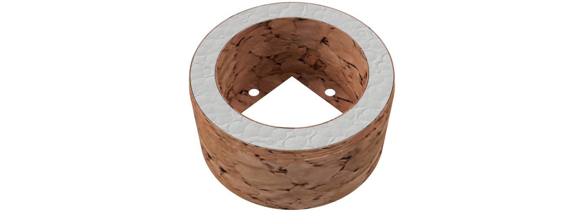
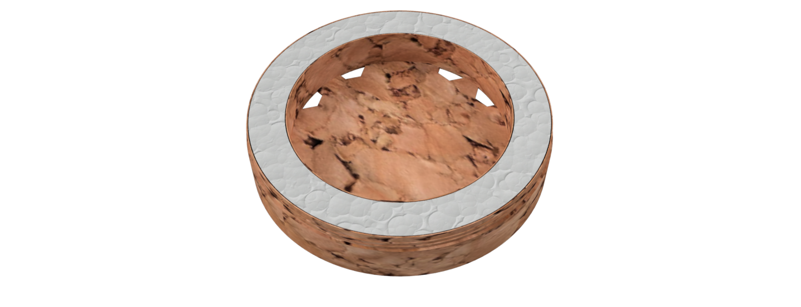

# HASF Box (Halla Abelha sem Ferrão)
It is the prototype of a stingless bee box that uses the concept of INPA boxes, thus facilitating handling. The objectives of this model are:
* facilitate management through 5 blocks: base, nest, over-nest, honey chamber and cover
* low cost and durable
* be scalable
* reduce human contact during the honey extraction process
* test the use of prefabricated honey pots
* be portable

## Motivation
In February 2015, [Flow Hive](https://www.honeyflow.com/) launched their Indiegogo campaign and surpassed their $70,000 goal 8 minutes later. They went on to raise $2.18 million in the first day. This shows how much people are interested in the topic and are willing to invest in beekeeping.
I found the idea brilliant and innovative, but when researching how I could create European or Africanized bees here in Brazil I came across a series of problems. Although it looks easy, it is not that simple and requires a license for creation. Many of the species available here are quite aggressive and even with this easy device it would require a handling course and protective equipment.
After research I discovered the stingless bees that in general are much less aggressive, their colonies are smaller and produce excellent quality honey, being very easy to breed. Embrapa Brazil, together with the Brazilian Association of Bee Studies, offers a free Meliponiculture course at https://www.youtube.com/watch?v=Mv78ZATrcTQ
During my research I noticed that the most used hive model in Brazil and even in other countries like Astralia is the INPA that were conceived by the researcher Fernando Oliveira when he worked at the National Institute for Research in the Amazon (INPA). The box model was baptized with its own name, Fernando Oliveira, however it became popular with the name of the institute.
The model was developed with the aim of facilitating the work of honey farmers. Thus optimizing the division of swarms and facilitating the collection of honey.
INPA boxes are made up of three basic modules: Nest, Over-Nest and Honey Chamber. So the size of the modules and the amount of honey pots will depend on each species of stingless bees that will be created in these INPA boxes.

## Modular Design
The proposed design has 5 blocks:
* Base: used for the entry of bees
* Nest: place where bees will place their honeycombs
* Over-nest: place where the bees will place the brood combs used for the division of the hive
* Honey Chamber: places where bees deposited honey
* Cover: beehive cover

### Section View

## Heat and Cold resistant
Bees are very sensitive to changes in temperature, so essential to a stable environment. In nature, they use tree hollows that have excellent thermal resistance. To guarantee this thermal comfort, all blocks have a 2 cm layer that must be filled with Styrofoam. Other insulators can also be used. As the walls have a thickness of 0.1 cm to give greater rigidity, a mixture of cement with styrofoam can be used.
The standards beehives used in beekeeping are built with the aim to maximise the honey production without really considering the comfort of the bees. These shelters which are very far to the natural habitat of the bees, weaken them by disturbing their metabolism. The cylindrical structure is the most efficient to save the warmth.

## Durable Materials
For testing purposes, 3D models are being printed with different types of material such as PLA, ABS, PET-G among others. The future goal is to make molds for the injection of recyclable plastic.
Perhaps more sustainable and better alternative for bees would be production using agglomerated cork. This material will be evaluated in the future as an alternative to plastic.

## Portable
The hive needs to be portable, allowing easy handling and transportation when necessary.

## Easy to Operate
Because it is modular and threadable, you can mix modules, increase the number of honey chamber, etc. Another positive point is the ease of collecting honey due to the fact that the jars have a pattern
Based on some studies found on the Internet and used in Malaysia, Australia and Brazil, I developed a honeycomb that has a hexagonal structure with a diameter of 1.6 cm and height of 1.6 cm to standardize the construction of honey pots thus facilitating the its extraction. This structure can be created in plastic or using beeswax with silicone mold.
The idea is to test with Jataí bees, but it can be used with other bees and you may need to change the dimensions. The current size was based on the following document [Efeito da padronização da altura de melgueiras para abelha Jataí](http://apacame.org.br/site/revista/mensagem-doce-n-145-marco-de-2018/artigo-5/?fbclid=IwAR1WRlwDaLafMQsi6imAG6ThI1SdjlGxfZeDl4RUsPbpFZx_EBIDRmaJwyM)

## Low Cost
The idea is to produce units in non-toxic and biodegradable plastic at low cost.

# Design Explanation

## Concept
The prototype uses the renowned INPA models but a cylindrical box thus allowing the use of threads to fit the modules, eliminating the need for tapes or other products to keep the modules together. Another benefit is the establishment of a standard for the honey cameras, thus allowing greater homogeneity, thus facilitating the harvest. One possibility would be to remove the honey cameras, replacing them with new ones and take the floods of honey for collection in a proper equipment or honey house.

## Base
The hive entrance is located at the base and has a thread for PET bottles so that the mouth of a bottle is placed whose objective is to prevent the attack of other insects such as ants. Inside the base, insulating material such as styrofoam should be placed in order to protect the hive, as well as create the path to the center so that the bees can reach the nest.

## Nest
There is a space of 20 mm between the external and internal wall for placing an insulating material such as Styrofoam. The inside of the nest has 120 mm in diameter with a central hole of 10 mm for the entrance of the bees. The internal part can be covered with wood if the meliponicultor wishes, such as cork or ice cream sticks.

## Over-Nest
it follows the same pattern of the nest with the difference that its base has a lower opening in the form of a square of 80 mm x 80 mm and 4 side entrances for the bees. The goal is that the bees also produce the honeycombs in the semen to facilitate the process of dividing the hive.

## Honey Chamber
It has honeycombs with a capacity to store approximately 5 ml of honey. The objective is to reduce the work of bees in the production of honeycombs or jars of honey and facilitate the extraction of honey.
Perhaps according to the type of bee, the honey pots need to have their size reduced or increased, so I think in the future that the honeycombs are not fixed, thus allowing to change the sizes as necessary.
Another possibility would be to produce jars of honey directly from beeswax using a silicone form.
Multiple honey chambers can be added one above the other to create a larger space for honey production

### Honeycomb Mold
It is a plastic piece for creating a silicone mold. With the silicone mold the honeycombs could be created from melted beeswax which would create a pattern for the bees facilitating the extraction of honey.
To make the silicone mold it is necessary to use liquid silicone, add the catalyst according to the manufacturer's instructions and pour it into the mold. When it is cured approximately 2 hours later, the mold can be removed from the mold.

## Cover
It must be filled with insulating material to close the hive

# Next Steps
- [ ] add electronic monitoring of temperature, humidity, etc;
- [ ] Create a honey driller and extractor;
- [x] improve design based on suggestions (version 2.0);
- [x] develop beeswax honeycombs (version 2.0);

# Version Changes
- 1.0 Initial version
- 2.0 Second release (21/05/2021)
  - Changed thread from inside to outside to prevent water from entering the thread
  - Built the inlet pipe
  - Changed the dimensions of the honey chamber based on the document [Efeito da padronização da altura de melgueiras para abelha Jataí](http://apacame.org.br/site/revista/mensagem-doce-n-145-marco-de-2018/artigo-5/?fbclid=IwAR1WRlwDaLafMQsi6imAG6ThI1SdjlGxfZeDl4RUsPbpFZx_EBIDRmaJwyM) for tests with Jataí bee
  - Creation of a silicone mold for the construction of beeswax honeycombs
  - Improved images

# More Information
- [Wiki](https://github.com/victorhalla/hasf/wiki)
- [3D Printed HoneyCombs Field Test](https://kelulutrepublic.wordpress.com/2017/07/07/3d-printed-honeycombs-field-test/comment-page-1/?unapproved=2&moderation-hash=403e7ae99b781c1bb0874c015ef65e81#comment-2)
- [Brazilian Native Stingless Bee - 3d Printing Honeycomb](https://www.instructables.com/Brazilian-Native-Stingless-Bee-3d-Printing-Honeyco/)
- [Polypropylene Pots](https://www.youtube.com/watch?v=-aZeShNmsOE&t=1047s)
- [Honey Withim the egg tray](https://www.youtube.com/watch?v=7kQxq85DMgE&t=269s)