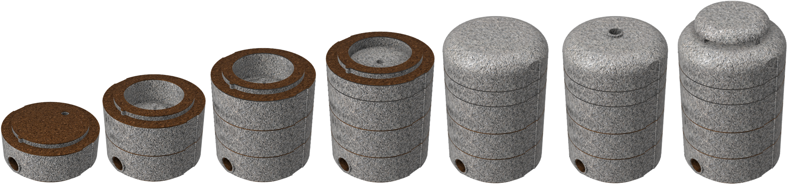

# HASF v2
HASF Stingles Bee Hive (Halla Abelha Sem Ferrão)

*Read this in other languages: [English](README.md), [Portuguese Brazil](README.pt-br.md)

It is the prototype of a stingless bee box that uses the concept of INPA boxes, thus facilitating handling. The objectives of this model are:
* facilitate management through 5 blocks: base, nest, over-nest, super (honey chamber) and cover
* low cost and durable
* be scalable
* reduce human contact during the honey extraction process
* test the use of prefabricated honey pots
* be portable
* be light
* withstand extreme cold and heat

## Table of Contents
  - [HASF](#Motivation)
    - [Motivation](#Motivation)
    - [Modular Design](#Modular-Design)
    - [Heat and Cold resistant](#Heat-and-Cold-resistant)
    - [Durable Materials](#Durable-Materials)
    - [Portable](#Portable)
    - [Easy to Operate](#Easy-to-Operate)
    - [Low Cost](#Low-Cost)
  - [Design Explanation](#Design-Explanation)
    - [Concept](#Concept)
    - [Base](#Base)
    - [Nest](#Nest)
    - [Over-Nest](#Over-Nest)
    - [Super (Honey Chamber)](#Honey-Chamber)
    - [Cover](#Cover)
  - [Eletronics](#Eletronics)
  - [Next Steps](#Next-Steps)
  - [Version Changes](#Version-Changes)
  - [More Information](#More-Information)

## Motivation
In February 2015, [Flow Hive](https://www.honeyflow.com/) launched their Indiegogo campaign and surpassed their $70,000 goal 8 minutes later. They went on to raise $2.18 million in the first day. This shows how much people are interested in the topic and are willing to invest in beekeeping.
I found the idea brilliant and innovative, but when researching how I could create European or Africanized bees here in Brazil I came across a series of problems. Although it looks easy, it is not that simple and requires a license for creation. Many of the species available here are quite aggressive and even with this easy device it would require a handling course and protective equipment.
After research I discovered the stingless bees that in general are much less aggressive, their colonies are smaller and produce excellent quality honey, being very easy to breed. Embrapa Brazil, together with the Brazilian Association of Bee Studies, offers a free Meliponiculture course at https://www.youtube.com/watch?v=Mv78ZATrcTQ
During my research I noticed that the most used hive model in Brazil and even in other countries like Astralia is the INPA that were conceived by the researcher Fernando Oliveira when he worked at the National Institute for Research in the Amazon (INPA). The box model was baptized with its own name, Fernando Oliveira, however it became popular with the name of the institute.
The model was developed with the aim of facilitating the work of honey farmers. Thus optimizing the division of swarms and facilitating the collection of honey.
INPA boxes are made up of three basic modules: Nest, Over-Nest and Honey Chamber. So the size of the modules and the amount of honey pots will depend on each species of stingless bees that will be created in these INPA boxes.

## Modular Design
The proposed design has 5 blocks:
* Base: used for the entry of bees. In version 2, a labyrinth was introduced to help contain pests
* Nest: Place where the bees will place the nest. In version 2, the inlet has been moved from the center to the side of the box so that the air stream does not fall directly on the nest.
* Over-nest: place where the bees will place the brood combs used for the division of the hive
* Super (Honey Chamber): places where bees deposited honey
* Cover: beehive cover
* Cover with Roof: beehive roof for covers with ventilation

### Section View

## Heat and Cold resistant
Bees are very sensitive to changes in temperature, so essential to a stable environment. In nature, they use tree hollows that have excellent thermal resistance. To guarantee this thermal comfort, the final product will be produced from a concrete composed of cement, glue, vermiculite and styrofoam.
Why am I not using wood like many others? Simple, the wood of a living tree has different properties than the wood we use, it is a material that has worse thermal properties than the above materials and the use of wood may not be sustainable. Remember that we are here looking for alternatives that provide better welfare to bees. The table below presents the coefficient of thermal conductivity of some materials for comparison:

Material | Weight kgf/m3 | Thermal Conductivity W/m.C |
-------- | ------------- | -------------------------- |
Concrete | 2300 | 1.4 |
Cellular Concrete | 300 - 600 | 0.057 - 0.14 |
Polyurethane foam | 30 - 40 | 0.023 |
Wood (Pine) | 550 | 0.16 - 0.35 |
Vermiculite | 70 | 0.76 |

Many beekeepers are making bee boxes (isothermal box) using styrofoam concrete or cellular concrete with excellent results. (https://www.youtube.com/watch?v=zlzW1eoSt5g)
The idea is to improve this concept by adding vermiculite, which offers good thermal properties, in addition to the water absorption property that can also help control internal humidity.

The concrete will be composed of 1 part concrete, 2 parts vermiculite and 7 parts styrofoam. At this point I'm assuming that the thermal conductivity with these 3 components would be around 0.05 W/m.C. Applying the calculations of thermal conduction of a cylinder, assuming the internal radius of 113mm and the temperature of the colony is 32C, we obtain the following wall thickness for each of the external temperatures:

A 30mm wall could withstand up to an outside temperature of 0C

## Durable Materials
For testing purposes, 3D models are being printed with different types of material such as PLA. The future goal is to make molds for the injection of recyclable plastic and Concrete

### PLA used for prototyping
PLA filament is a material used for 3D printing, famous for having its degradation process biologically activated.
PLA is a thermoplastic polymer made with lactic acid from raw materials that have renewable sources.
Its preparation can be made from vegetables such as corn, manioc, beets or sugar cane.
Because it comes from organic matter, PLA is biodegradable and, therefore, compostable and recyclable.

### Recycled Polypropylene
This material is being considered more as an alternative to PVC and PET because of its clarity and its ease of converting. Much of the polypropylene is being used for closures on bottles, but at PolyPrime we have found this material to be a versatile material. Polypropylene has all the characteristics of HDPE with the added benefit of being produced in clears and tints. Even though polypropylene is not recyclable in a substantial number of municipalities, it is considered a sustainable material because it can be designed to reduce packaging and creates new packaging alternatives by using one substrate (i.e. paperboard box with a clear vinyl window).

### Light Concrete
Light concrete is a type of concrete with lower density that has numerous advantages of use and can be applied mainly in the construction of slabs and paving. Elements such as tiles, pillars, benches and counters can also present this material, with varying densities, adapted to the purpose of each element. The main advantages are:
- Thermal and acoustic insulation
- High resistance to impact and moisture
- Easier handling and applications
- Lightness and reduced transport costs
- Decreased fire risk
- Higher productivity in assembly and installation
- Flexibility, with different densities and patterns
- 100% recyclable material
- Compliance with technical standards
Light Concrete can be made of foam or expanded vermiculite in a 10:1 ratio.

## Portable
The hive needs to be portable, allowing easy handling and transportation when necessary.

## Easy to Operate
Because it is modular and threadable, you can mix modules, increase the number of honey chamber, etc. Another positive point is the ease of collecting honey due to the fact that the jars have a pattern
Based on some studies found on the Internet and used in Malaysia, Australia and Brazil, I developed a honeycomb that has a hexagonal structure with a diameter of 1.6 cm and height of 1.6 cm to standardize the construction of honey pots thus facilitating the its extraction. This structure can be created in plastic or using beeswax with silicone mold.
The idea is to test with Jataí bees, but it can be used with other bees and you may need to change the dimensions. The current size was based on the following document [Efeito da padronização da altura de melgueiras para abelha Jataí](http://apacame.org.br/site/revista/mensagem-doce-n-145-marco-de-2018/artigo-5/?fbclid=IwAR1WRlwDaLafMQsi6imAG6ThI1SdjlGxfZeDl4RUsPbpFZx_EBIDRmaJwyM)

## Low Cost
The idea is to produce units in non-toxic and biodegradable plastic at low cost.

# Design Explanation

## Concept
The prototype uses the renowned INPA models but a cylindrical box thus allowing the use of threads to fit the modules, eliminating the need for tapes or other products to keep the modules together. Another benefit is the establishment of a standard for the honey cameras, thus allowing greater homogeneity, thus facilitating the harvest. One possibility would be to remove the honey cameras, replacing them with new ones and take the floods of honey for collection in a proper equipment or honey house.

## Base
The hive entrance is located at the base and has a thread for PET bottles so that the mouth of a bottle is placed whose objective is to prevent the attack of other insects such as ants. Inside the base, insulating material such as styrofoam should be placed in order to protect the hive, as well as create the path to the center so that the bees can reach the nest.

## Nest
There is a space of 20 mm between the external and internal wall for placing an insulating material such as Styrofoam. The inside of the nest has 120 mm in diameter with a central hole of 10 mm for the entrance of the bees. The internal part can be covered with wood if the meliponicultor wishes, such as cork or ice cream sticks.

## Over-Nest
it follows the same pattern of the nest with the difference that its base has a lower opening in the form of a square of 80 mm x 80 mm and 4 side entrances for the bees. The goal is that the bees also produce the honeycombs in the semen to facilitate the process of dividing the hive.

## Super (Honey Chamber)
It has honeycombs with a capacity to store approximately 5 ml of honey. The objective is to reduce the work of bees in the production of honeycombs or jars of honey and facilitate the extraction of honey.
Perhaps according to the type of bee, the honey pots need to have their size reduced or increased, so I think in the future that the honeycombs are not fixed, thus allowing to change the sizes as necessary.
Another possibility would be to produce jars of honey directly from beeswax using a silicone form.
Multiple honey chambers can be added one above the other to create a larger space for honey production

### Honeycomb Mold
It is a plastic piece for creating a silicone mold. With the silicone mold the honeycombs could be created from melted beeswax which would create a pattern for the bees facilitating the extraction of honey.
To make the silicone mold it is necessary to use liquid silicone, add the catalyst according to the manufacturer's instructions and pour it into the mold. When it is cured approximately 2 hours later, the mold can be removed from the mold.

## Cover
It will cover the hive box. A second version with top ventilation is also available.

## RooF
A roof for conver with ventilation.

# Models
Just as there are several types of stingless bees, it could not be different with hives, in this way, 5 sizes will be available according to the table below: 

Model	| Internal Diameter Cylindrical Beehive (mm)	| External Diameter Cylindrical Beehive (mm)	| Nest Height (mm)	| Nest Volume (ml)	| Honey Chamber Height (mm)	| Honey Chamber Volume (ml)
---- |---- |---- |---- |---- |---- |----
A	| 113	| 193	| 50	| 500	| 20	| 200
B	| 135	| 215	| 50	| 720	| 20	| 288
C	| 169	| 249	| 75	| 1688	| 30	| 675
D	| 181	| 261	| 70	| 1793	| 28	| 717
E	| 226	| 306	| 80	| 3202	| 32	| 1281

The hives may be suitable for the following bees:

Model | Bees
----- | ---- 
A | Lambe Olhos, Mirim Droryana, Mirim Guaçu, Mirim Preguiça
B | Iraí, Jatai
C | Guaraipo, Jandaíra, Jupará, Mandaçaia MQA, Tiubá
D | Manduri
E | Borá, Bugia, Canudo, Mandaçaia MQQ, Mandaguari, Mombucão, Tubi,Tubuna, Uruçu

# Eletronics
To date, little is observed in the use of tools and sensors to better understand stingless bees. In part because the technology is still very expensive and there is no established standard for it. 
The goal here is to create low-cost electronic equipment that can be easily installed and operated by farmers.
Initially we have the idea that the equipment can use the follwing modules:
- LLILYGO® TTGO T-OI Plus ESP32-C3 (Processor - US $5.79)
- Indoor and outdoor temperature and humidity (Waterproof SHT30 sensor - US $3.75)
- Box load Cell (Module HX711 - US $1.35)
- Lithium Battery (16340 - US $2.97)

# Next Steps
- [ ] add electronic monitoring of temperature, humidity, etc;
- [ ] Create a honey driller and extractor;
- [x] improve design based on suggestions (version 2.0);
- [x] develop beeswax honeycombs (version 2.0);

# Version Changes
- 2.0 Second release (21/05/2021)
  - Changed thread from inside to outside to prevent water from entering the thread
  - Built the inlet pipe
  - Changed the dimensions of the honey chamber based on the document [Efeito da padronização da altura de melgueiras para abelha Jataí](http://apacame.org.br/site/revista/mensagem-doce-n-145-marco-de-2018/artigo-5/?fbclid=IwAR1WRlwDaLafMQsi6imAG6ThI1SdjlGxfZeDl4RUsPbpFZx_EBIDRmaJwyM) for tests with Jataí bee
  - Creation of a silicone mold for the construction of beeswax honeycombs
  - Improved images
- 1.0 Initial version
  

# More Information
- [Wiki](https://github.com/victorhalla/hasf/wiki)
- [3D Printed HoneyCombs Field Test](https://kelulutrepublic.wordpress.com/2017/07/07/3d-printed-honeycombs-field-test/comment-page-1/?unapproved=2&moderation-hash=403e7ae99b781c1bb0874c015ef65e81#comment-2)
- [Brazilian Native Stingless Bee - 3d Printing Honeycomb](https://www.instructables.com/Brazilian-Native-Stingless-Bee-3d-Printing-Honeyco/)
- [Polypropylene Pots](https://www.youtube.com/watch?v=-aZeShNmsOE&t=1047s)
- [Honey Withim the egg tray](https://www.youtube.com/watch?v=7kQxq85DMgE&t=269s)