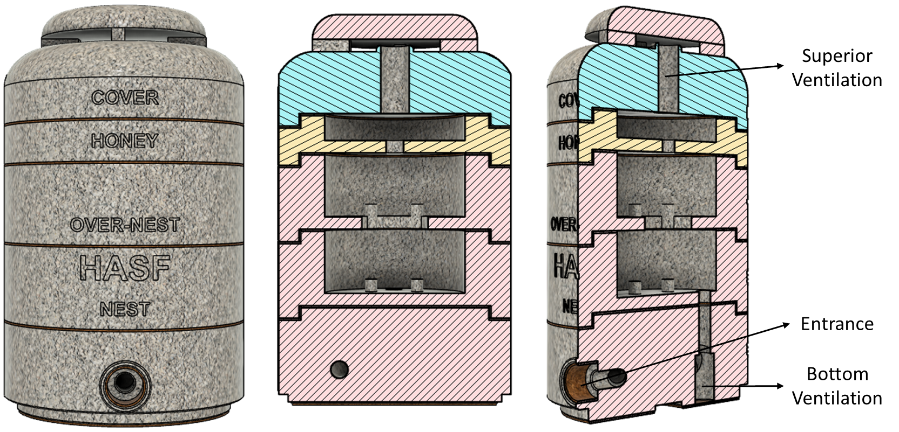
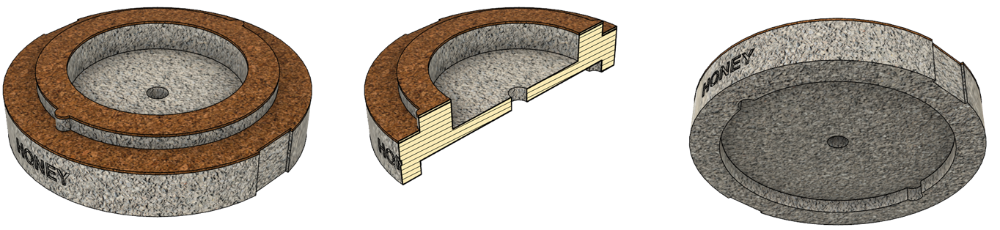
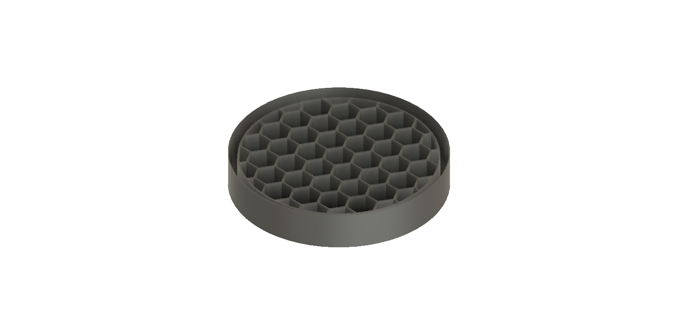
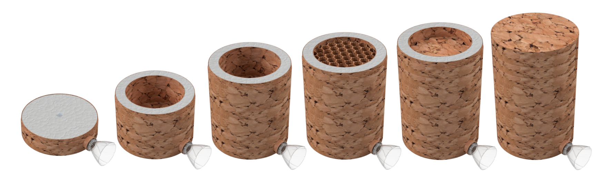

# HASF v2
Caixa HASF (Halla Abelha Sem Ferrão)

*Leia este em outros idiomas: [English](README.md), [Portuguese Brazil](README.pt-br.md)

É o protótipo de uma caixa de abelhas sem ferrão que utiliza o conceito de caixas do INPA, facilitando o manuseio. Os objetivos deste modelo são:
* facilitar o manejo através de 5 componentes: base, ninho, sobre-ninho, melgueira (câmara de mel) e cobertura
* baixo custo e durável
* ser escalável
* reduzir o contato humano durante o processo de extração do mel
* testar o uso de potes de mel pré-fabricados
* ser portátil
* seja leve
* suportar frio e calor extremos

## Índice
   - [HASF v2](#HASF-v2)
     - [Motivação](#Motivação)
     - [Design Modular](#Design-Modular)
     - [Resistente ao calor e ao frio](#Resistente-ao-calor-e-ao-frio)
     - [Materiais Duráveis](#Materiais-Duráveis)
     - [Portátil](#Portátil)
     - [Fácil de operar](#Fácil-de-operar)
     - [Baixo Custo](#Low-Cost)
   - [Explicação do projeto](#Explicação-do-projeto)
     - [Conceito](#Conceito)
     - [Base](#Base)
     - [Ninho](#Ninho)
     - [Sobre-Ninho](#Sobre-Ninho)
     - [Melgueira](#Melgueira)
     - [Cobertura](#Cobertura)
     - [Telhado](#Telhado)
     - [Placas de Cortiça](#Placas-de-Cortiça)
     - [Separadores de Acetato](#Separadores-de-Acetato)
     - [Cinta de Engate Rápido](#Cinta-de-Engate-Rápido)
     - [Em Utilização](#Em-Utilização)
   - [Outras Partes](#Outras-Partes)
     - [Ninho Armadilha](#Ninho-Armadilha)
     - [Alimentador](#Alimentador)
     - [Tampa Ventilação](#Tampa-Ventilação)
   - [Eletrônicos](#Eletrônicos)
   - [Próximas etapas](#Próximas-etapas)
   - [Alterações de versão](#Alterações-de-versão)
   - [Mais informações](#Mais-Informações)

## Motivação
Em fevereiro de 2015, [Flow Hive](https://www.honeyflow.com/) lançou sua campanha no Indiegogo e superou sua meta de US$ 70.000 8 minutos depois. Eles arrecadaram US$ 2,18 milhões no primeiro dia. Isso mostra o quanto as pessoas se interessam pelo tema e estão dispostas a investir na apicultura.
Achei a ideia brilhante e inovadora, mas ao pesquisar como poderia criar abelhas europeias ou africanizadas aqui no Brasil me deparei com uma série de problemas. Embora pareça fácil, não é tão simples e requer uma licença para criação. Muitas das espécies aqui disponíveis são bastante agressivas e mesmo com este dispositivo fácil seria necessário um curso de manejo e equipamentos de proteção.
Após pesquisas descobri as abelhas sem ferrão que em geral são bem menos agressivas, suas colônias são menores e produzem mel de excelente qualidade, sendo muito fáceis de reproduzir. A Embrapa Brasil, juntamente com a Associação Brasileira de Estudos Apícolas, oferece curso gratuito de Meliponicultura em https://www.youtube.com/watch?v=Mv78ZATrcTQ
Durante minha pesquisa percebi que o modelo de caixa mais utilizado no Brasil e até em outros países como a Astralia é o INPA que foi idealizado pelo pesquisador Fernando Oliveira quando trabalhava no Instituto Nacional de Pesquisas da Amazônia (INPA). O modelo de caixa foi batizado com o próprio nome, Fernando Oliveira, porém ficou popular com o nome do instituto.
O modelo foi desenvolvido com o objetivo de facilitar o trabalho dos produtores de mel. Otimizando assim a divisão dos enxames e facilitando a coleta do mel.
As caixas INPA são compostas por três módulos básicos: Ninho, Sobre-Ninho e Melgueira. Assim, o tamanho dos módulos e a quantidade de potes de mel vão depender de cada espécie de abelha sem ferrão que será criada nessas caixas do INPA.

## Design modular
O projeto proposto tem 5 componentes:
* Base: utilizada para a entrada de abelhas. Na versão 2, foi introduzido um labirinto para ajudar a conter pragas
* Ninho: Local onde as abelhas vão colocar o ninho. Na versão 2, a entrada foi movida do centro para a lateral da caixa para que a corrente de ar não caia diretamente no ninho.
* Sobre-ninho: local onde as abelhas colocarão os favos de cria utilizados para a divisão da caixa
* Melgueira: locais onde as abelhas depositam o mel
* Cobertura: cobertura da caixa
* Cobertura com Telhado: telhado da caixa para coberturas com ventilação

### Section View

## Resistente ao calor e ao frio
As abelhas são muito sensíveis às mudanças de temperatura, por isso essenciais para um ambiente estável. Na natureza, utilizam ocos de árvores que possuem excelente resistência térmica. Para garantir esse conforto térmico, o produto final será produzido a partir de um concreto composto por cimento, cola, vermiculita e isopor.
Por que não estou usando madeira como muitos outros? Simples, a madeira de uma árvore viva tem propriedades diferentes da madeira que usamos, é um material que tem propriedades térmicas piores que os materiais acima e o uso da madeira pode não ser sustentável. Lembre-se que estamos aqui buscando alternativas que proporcionem melhor bem-estar às abelhas. A tabela abaixo apresenta o coeficiente de condutividade térmica de alguns materiais para comparação:

Materiais | Peso kgf/m3 | Condutividade Térmica W/m.C |
-------- | ------------- | -------------------------- |
Concreto | 2300 | 1.4 |
Concreto Celular | 300 - 600 | 0,057 - 0,14 |
Espuma de poliuretano | 30 - 40 | 0,023 |
Madeira (Pinho) | 550 | 0,16 - 0,35 |
Vermiculita | 70 | 0,76 |

Muitos meliponicultores estão fazendo caixas de abelhas (caixa isotérmica) usando concreto de isopor ou concreto celular com excelentes resultados. (https://www.youtube.com/watch?v=zlzW1eoSt5g)
A ideia é aprimorar esse conceito com a adição de vermiculita, que oferece boas propriedades térmicas, além da propriedade de absorção de água que também pode ajudar a controlar a umidade interna.
O concreto será composto de 1 parte de concreto, 2 partes de vermiculita e 7 partes de isopor. Neste ponto, estou assumindo que a condutividade térmica com esses 3 componentes seria em torno de 0,05 W/m.C. 
Aplicando os cálculos de condução térmica de um cilindro, assumindo o raio interno de 113mm e a temperatura da colônia de 32ºC, obtemos a seguinte espessura de parede para cada uma das temperaturas externas:

Uma parede de 30 mm pode suportar uma temperatura externa de até 0ºC e estamos utiilizando paredes de 40 mm para ter um suporte térmico adicional.
Vale lembrar que os calculos aqui realizados tem como base um sistema fechado, no entanto, um ninho de abelha é um sistema aberto, pois quase todo o tempo a porta de entrada esta aberta, permitindo que o ar entre de forma mais intensa. Como a entrada é realizada na base, em um pavimento inferior, isto tende a ajudar no isolamento termico.
Para caixas impressas em 3D as paredes serão ocas e posteriormente preenchidas com espuma PU que é um escelente isolante térmico.

## Materiais duráveis
Para fins de teste, os modelos 3D estão sendo impressos com PLA. O objetivo futuro é que as pessoas possam fazer caixas impressas em 3D ou comprar caixas de plástico reciclável ou concreto

### PLA usado para prototipagem
O filamento PLA é um material utilizado para impressão 3D, famoso por ter seu processo de degradação ativado biologicamente.
O PLA é um polímero termoplástico feito com ácido lático proveniente de matérias-primas que possuem fontes renováveis.
Sua preparação pode ser feita a partir de vegetais como milho, mandioca, beterraba ou cana-de-açúcar.
Por ser proveniente de matéria orgânica, o PLA é biodegradável e, portanto, compostável e reciclável.

### Polipropileno Reciclado
Este material está sendo considerado mais como uma alternativa ao PVC e PET devido à sua clareza e facilidade de conversão. Grande parte do polipropileno está sendo usado para fechamentos de garrafas, mas na PolyPrime descobrimos que esse material é um material versátil. O polipropileno possui todas as características do PEAD com o benefício adicional de ser produzido em transparentes e tintos. Embora o polipropileno não seja reciclável em um número substancial de municípios, é considerado um material sustentável, pois pode ser projetado para reduzir embalagens e criar novas alternativas de embalagens usando um único substrato (ou seja, caixa de papelão com janela de vinil transparente).

### Concreto Leve
O concreto leve é ​​um tipo de concreto com menor densidade que possui inúmeras vantagens de uso e pode ser aplicado principalmente na construção de lajes e pavimentação. Elementos como azulejos, pilares, bancadas e balcões também podem apresentar este material, com densidades variadas, adaptadas à finalidade de cada elemento. As principais vantagens são:
- Isolamento térmico e acústico
- Alta resistência ao impacto e umidade
- Manuseio e aplicações mais fáceis
- Leveza e custos de transporte reduzidos
- Diminuição do risco de incêndio
- Maior produtividade na montagem e instalação
- Flexibilidade, com diferentes densidades e padrões
- Material 100% reciclável
- Conformidade com as normas técnicas
O Concreto Leve pode ser feito de espuma ou vermiculita expandida na proporção de 10:1.

## Portátil
A caixa precisa ser portátil, permitindo fácil manuseio e transporte quando necessário.

## Fácil de operar
Por ser modular e encaixavel, você pode misturar módulos, aumentar o número de câmaras de mel, etc.
Com base em alguns estudos encontrados na internet e utilizados na Malásia, Austrália e Brasil, desenvolvi um favo de mel que possui estrutura hexagonal com diâmetro de 1,6 cm e altura de 1,6 cm para padronizar a construção dos potes de mel facilitando assim a sua extração. Essa estrutura pode ser criada em plástico ou usando cera de abelha com molde de silicone.
A ideia é testar com abelhas Jataí, mas pode ser usado com outras abelhas e pode ser necessário alterar as dimensões. O tamanho atual baseado no seguinte documento  [Efeito da padronização da altura de melgueiras para abelha Jataí](http://apacame.org.br/site/revista/mensagem-doce-n-145-marco-de-2018/artigo-5/?fbclid=IwAR1WRlwDaLafMQsi6imAG6ThI1SdjlGxfZeDl4RUsPbpFZx_EBIDRmaJwyM)

## Baixo custo
A ideia é produzir unidades em plástico atóxico e biodegradável e também em concreto leve a baixo custo.

# Explicação do projeto
## Conceito
O protótipo utiliza os mesmos conceitos e dimensões das caixas INPA em um formato cilíndrico, melhor simulando o oco de árvores e utilizando encaixes que permitem uma completa vedação da caixa, dispensando a necessidade de fitas ou outros produtos para manter os módulos unidos, reduzindo assim riscos de ataques externos. Este modelo permite a fácil troca de módulos entre caixas, facilitando o manuseio, divisão, homogeneidade e colheita do mel. Uma possibilidade seria retirar as melgueiras, substituindo-as por novas e levá-las para coleta em equipamento próprio melhorando assim sua qualidade.
Na parte superior de cada modulo são coladas placas de cortiça que tem como objetivo fazer a vedação entre cada modulo. Alem das placas de cortiça, também são instalados separadores de acetato facilitando assim a abertura dos módulos que poderiam estar coladas por conta da própolis.
Os modelos 3d poderão ser impressos e utilizados diretamentecomo caixa de abelha, porem sua produção em larga escala ainda é economicamente inviavel devido ao longo tempo de impressão. Será criado um manual para aqueles que desejam utilizar caixas impressas em PLA.

## Base
A base foi desenvolvida levando em consideração três objetivos principais: reduzir a possibilidade de ataque de outros animais externos, reduzir o impacto da redução de temperatura na caixa e permitir a futura instalação de dispositivos eletrônicos para monitorar a caixa.
A entrada possui um uma boca que possibilita a instalação de garrafas PET cortadas com objetivo de proteger de ataques externos de lagartixas, formigas etc. Internamente, possui um corredor paralelo ao raio esquerdo indo da frente ao fundo, criando uma espécie de labirinto para dificultar a entrada de outros animais.
Na parte de baixo existe um a abertura para ventilação que caso não seja necessária pode ser fechado simplesmente com uma rolha de cortiça. No caso do uso da ventilação, é colocado um anel com uma tela permitindo a ventilação, mas impedindo a passagem de outros animais.
Na versão com sistemas eletrônicos, possui uma cavidade para instalação do sistema e sensores que serão conectados ao ninho.

## Ninho
A entrada das abelhas ao ninho é realizada por um orifício no fundo do modulo conectado a base. Em uma primeira versão, este orifício estava alocado no centro da caixa, sendo alterado para permitir uma maior distância entre a entrada e o ninho e para que o fluxo de ventilação não incida diretamente no ninho. Na base do ninho existem 4 pilares pequenos para permitir o apoio do ninho.

## Sobre Ninho
O sobre ninho possui aberturas adicionais para facilitar a movimentação entre o ninho e sobre ninho enquanto mantem pilares similares ao ninho, permitindo assim uma divisão mais simples.

## Melgueira
A melgueira foi construída com base em um estudo que consiste em reduzir sua altura para permitir que não existam potes de mel um sobre os outros, que tem como objetivo, facilitar a coleta de mel, utilizando por exemplo equipamentos de sucção, o que poderia manter os potes de mel intactos fazendo pequenas aberturas no topo. Este modelo reduziria os impactos ao exame que após uma coleta de mel precisa reconstruir os potes.
Uma segunda opção para reduzir a necessidade de construção de potes de mel, é a instalação de potes pré-fabricados em plásticos ou impressos em 3D. Este modelo esta em testes e já notamos que existe uma aceitação boa das abelhas, mas precisa ser testado com mais espécies.
A terceira opção seria a pré-fabrico de potes de mel em cera, utilizando moldes de silicone conforme apresentado no proximo tópico.

### Molde para Potes de Mel
É basicamente um molde plástico ou impresso em 3D para a criação de moldes de silicone que seriam utilizados para a pré-fabricação de potes de mel. Inicialmente estou utilizando um modelo semelhante as abelhas europeias apenas para melhorar o uso de espaço, mas outros modelos serão testados também.

## Cobertura
Foram desenvolvidas duas coberturas, uma totalmente fechada e uma com um orifício superior para a ventilação. No caso do uso do modelo com ventilação, será necessário o uso de um anel em conjunto com uma tela e então um telhado para evitar entrada de água.

## Telhado
O telhado se faz necessário apenas no modelo com ventilação na cobertura.

## Placas de Cortiça
Utiliza-se placas de cortiça coladas na parte superior de cada modulo para permitir uma melhor vedação. Entende-se que outros materiais podem ser utilizadas para este fim, como borracha, espuma etc.

## Separadores de Acetato
Entre os modulos são utilizados dois separadores de acetato, para facilitar a abertura dos mesmos que muitas vezes acabam colados pelo propolis.

## Cinta de Engate Rápido
Para garantir uma maior dificuldade na abertura da caixa, podemos utilizar uma cinta de engate rápido, pois a caixa possui ranhuras laterais justamente para isto. Este processo se mostrou extremamente simples para garantir que todos os modulos da caixa permaneçam juntos.

## Em Utilização
Aqui apresento uma caixa que esta em uso desde de Outubro de 2021, produzida em PLA com enximento das parede em espuma PU.

# Modelos
Assim como existem vários tipos de abelhas sem ferrão, não poderia ser diferente com as caixas, desta forma, estarão disponíveis 5 tamanhos conforme tabela abaixo:

Modelo | Caixa Cilíndrica de Diâmetro Interno (mm) | Caixa Cilíndrica de Diâmetro Externo (mm) | Altura do ninho (mm) | Volume do ninho (ml) | Altura da Melgueira (mm) | Volume da Melgueira (ml)
---- |---- |---- |---- |---- |---- |----
A | 113 | 193 | 50 | 500 | 20 | 200
B | 135 | 215 | 50 | 720 | 20 | 288
C | 169 | 249 | 75 | 1688 | 30 | 675
D | 181 | 261 | 70 | 1793 | 28 | 717
E | 226 | 306 | 80 | 3202 | 32 | 1281

As caixas podem ser adequadas para as seguintes abelhas:

Modelo | abelhas
----- | ----
A | Lambe Olhos, Mirim Droryana, Mirim Guaçu, Mirim Preguiça
B | Irai, Jataí
C | Guaraipo, Jandaira, Jupará, Mandaçaia MQA, Tiubá
D | Manduri
E | Borá, Bugia, Canudo, Mandaçaia MQQ, Mandaguari, Mombucão, Tubi, Tubuna, Uruçu

# Outras Partes
Adicionalmente as caixas, outras peças foram criadas com intuito de facilitar o uso e manuseio, como:

## Ninho Armadilha
A captura de enxames é feita através da utilização de Ninho Armandilha através do processo de enxameação. Quando a colônia está bastante forte e com grande população, produz uma nova rainha que juntamente com parte das operárias forma uma nova
colônia em outro lugar.
As operárias que saem à procura de novos locais para construir seu ninho geralmente buscam ocos que já foram habitados por outras colônias de abelhas, pois assim podem aproveitar os materiais de construção restantes. Por isso, é muito comum atrair enxames para caixas velhas que já foram utilizadas por outras abelhas. Com base nessas observações, os criadores descobriram que basta passar extrato de própolis e um pouco de cera em recipientes ocos que os enxames são atraídos.
Atualmente os ninhos armadilhas são construidos em sua maioria de garrafas PET enroladas em papel/papelão cobertas com alguma material escuro, me geral plastico preto, conforme a a imagem abaixo:

Partindo da afirmação de que as abelhas preferem locais já habitados anteriormente por abelhas, a ideia é criar um ninho armadilha que possa ser reutilizável. Usando o mesmo conceito utilizado aqui, foi desenhado um ninho armadilha produzido de concreto leve que pode ser facilmente aberto pois é fechado usando uma cinta de engate rápido, permitindo assim a sua reutilização.

## Alimentador

## Tampa de Ventilação

# Eletrônicos
Até o momento, pouco se observa no uso de ferramentas e sensores para melhor compreensão das abelhas sem ferrão. Em parte, porque a tecnologia ainda é muito cara e não existe um padrão estabelecido para ela.
Para simplificar e já buscar algo disponivel no mercado, realizei a compra de medidores de temperatura e umidade que pudessem ser instalados dentro das caixas e permitissem a leitura remota através de Bluetooth como os sensores “ORIA Thermometer Hygrometer”

Este sensor cumpriu com o objetivo de coletar informações de temperatura e humidade conforme apresentando abaixo em uma caixa com abelhas Mirim, podendo armazenar pois até dois meses. O ponto negativo é que a bateria dura entre 1 e 2 meses. Como pode-se ver nos gráficos abaixo, a temepratura se manteve entre 31ºC e 28ºC.

Um próximo passo seria de criar um equipamento eletrônico de baixo custo que possam ser facilmente instalados e operados pelos meliponicultores, com a capacidade de monitorar os seguintes pontos:
- Temperatura e humidade
- Som e/ou ruido interno
- População da caixa através da monitoração ode entrada e saída de abelhas
- Peso da caixa para monitoração da produção de mel e saúde das abelhas

Inicialmente temos a ideia de que o equipamento pode utilizar os seguintes módulos:
- LLILYGO® TTGO T-OI Plus ESP32-C3 (MCU - US$ 5,79)
- Temperatura e umidade interna e externa (sensor SHT30 à prova d'água - US $ 3,75)
- Célula de carga de caixa (Módulo HX711 - US $ 1,35)
- Bateria de lítio (16340 - US$ 2,97)

# Próximos passos
- [ ] adicionar monitoramento eletrônico de temperatura, umidade, etc;
- [ ] Criar um perfurador e extrator de mel;
- [x] melhorar o design com base em sugestões (versão 2.0);
- [x] desenvolver favos de mel de cera de abelha (versão 2.0);

# Alterações de versão
- 2.0 Segunda versão (21/05/2021)
  - Mudou a rosca de dentro para fora para evitar que a água entre na rosca
  - Construiu o tubo de entrada
  - Alterado as dimensões da câmara de mel do documento [Efeito da altura1. da altura de melgueiras para abelha Jataí.org.br/site/revista/mensagem]-doce-n- -2018/artigo-5/?fbclid=IwAR1WRlwDaLafMQsi6imAG6ThI1SdjlGxfZeDl4RUsPbpFZx_EBIDRmaJwyM) para testes com abelha Jataí
  - Criação de um molde de silicone para a construção de favos de cera de abelha
  - Imagens melhoradas
- 1.0 Versão inicial
  

# Mais Informações
- [Wiki](https://github.com/victorhalla/hasf/wiki)
- [Teste de campo de favos de mel impressos em 3D](https://kelulutrepublic.wordpress.com/2017/07/07/3d-printed-honeycombs-field-test/comment-page-1/?unapproved=2&moderation-hash=403e7ae99b781c1bb0874c015ef65e81#comment-2)
- [Abelha sem ferrão nativa brasileira - favo de mel para impressão 3D](https://www.instructables.com/Brazilian-Native-Stingless-Bee-3d-Printing-Honeyco/)
- [Potes de polipropileno](https://www.youtube.com/watch?v=-aZeShNmsOE&t=1047s)
- [Mel dentro da bandeja de ovos](https://www.youtube.com/watch?v=7kQxq85DMgE&t=269s)